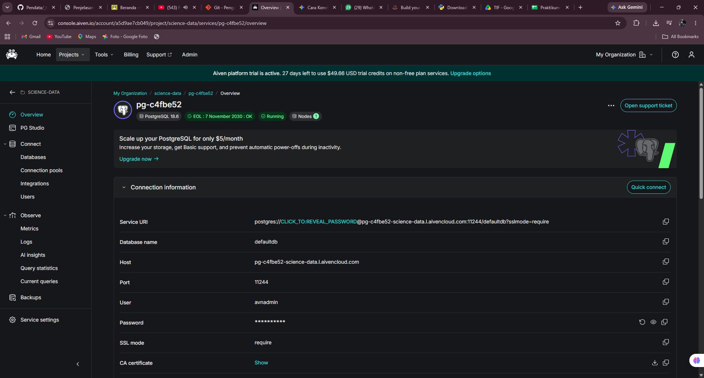
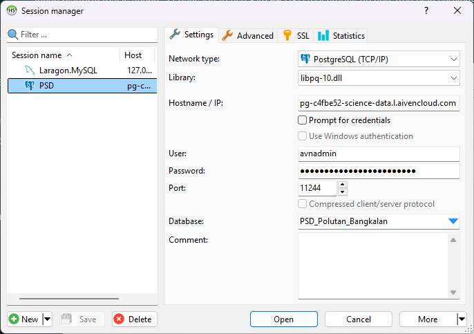
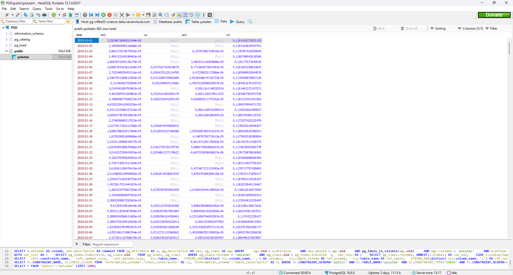
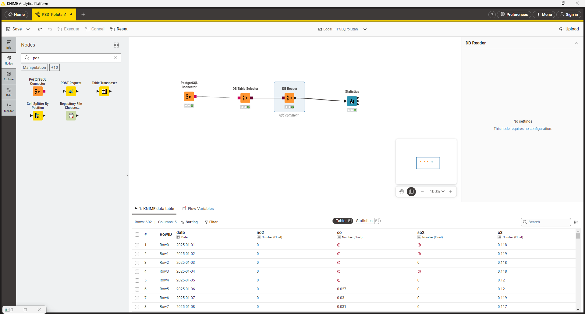
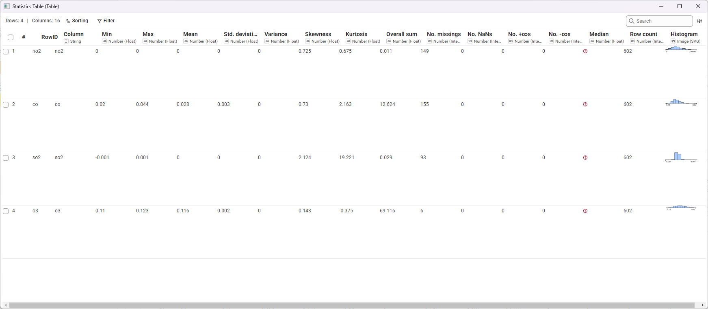

# Penjelasan Metrik Statistika Deskriptif

Dalam analisis data, ringkasan metrik yang ditampilkan pada tabel disebut sebagai **Statistika Deskriptif (Descriptive Statistics)**. Hasil ini biasanya digunakan pada tahap awal analisis, yaitu **Exploratory Data Analysis (EDA)**, untuk memahami karakteristik, distribusi, dan kualitas data sebelum dilakukan pemrosesan lebih lanjut, peramalan (*forecasting*), atau pemodelan.

Tabel tersebut menampilkan ringkasan untuk beberapa variabel konsentrasi polutan udara ($NO_2$, $CO$, $SO_2$, $O_3$). Berikut adalah penjelasan masing-masing metrik beserta cara perhitungan manualnya:

## 1. Min & Max
*   **Penjelasan:** Nilai observasi terendah (Min) dan tertinggi (Max) dalam satu set data. Metrik ini digunakan untuk melihat batas bawah dan batas atas rentang data.
*   **Perhitungan Manual:** Urutkan seluruh data dari nilai terkecil hingga terbesar.
    *   $Min = X_1$ (Data urutan pertama)
    *   $Max = X_n$ (Data urutan terakhir)

## 2. Mean
*   **Penjelasan:** Nilai pusat dari kumpulan data, dihitung dengan menjumlahkan semua observasi lalu membaginya dengan jumlah total observasi yang valid.
*   **Perhitungan Manual:**
    $$ \bar{x} = \frac{\sum_{i=1}^{n} x_i}{n} $$
    *(Jumlahkan seluruh nilai konsentrasi polutan, kemudian bagi dengan total baris data yang ada)*.

## 3. Std. Deviation
*   **Penjelasan:** Mengukur seberapa jauh rata-rata penyimpangan titik-titik data terhadap nilai Mean-nya. Standar deviasi yang rendah menunjukkan data mengelompok dekat dengan rata-rata (konsisten), sedangkan nilai yang tinggi menunjukkan rentang fluktuasi yang besar.
*   **Perhitungan Manual (Sampel):**
    $$ s = \sqrt{\frac{\sum_{i=1}^{n} (x_i - \bar{x})^2}{n-1}} $$

## 4. Variance
*   **Penjelasan:** Rata-rata dari kuadrat selisih masing-masing titik data dengan nilai Mean. Varians secara matematis adalah kuadrat dari nilai Standar Deviasi.
*   **Perhitungan Manual (Sampel):**
    $$ s^2 = \frac{\sum_{i=1}^{n} (x_i - \bar{x})^2}{n-1} $$

## 5. Skewness 
*   **Penjelasan:** Mengukur derajat asimetri (ketidakseimbangan) dari distribusi data terhadap nilai rata-ratanya.
    *   *Skewness = 0*: Data terdistribusi simetris / normal berpusat di tengah.
    *   *Skewness > 0 (Positif)*: Ekor grafik memanjang ke kanan (kondisi nilai ekstrem yang tinggi). Contoh pada data observasi $SO_2$ dengan nilai 2.124.
    *   *Skewness < 0 (Negatif)*: Ekor grafik memanjang ke kiri.
*   **Perhitungan Manual (Fisher-Pearson):**
    $$ Skewness = \frac{n}{(n-1)(n-2)} \sum_{i=1}^{n} \left(\frac{x_i - \bar{x}}{s}\right)^3 $$

## 6. Kurtosis
*   **Penjelasan:** Mengukur tingkat "keruncingan" atau bobot ekor dari distribusi data (*tailedness*). Menunjukkan seberapa ekstrem *outlier* dalam data. Sebagian besar *software* secara spesifik mengukur *Excess Kurtosis*.
    *   *Kurtosis ≈ 0*: Normal (Mesokurtik).
    *   *Kurtosis > 0*: Puncak tajam dengan ekor tebal yang menandakan banyak outlier ekstrem tinggi atau rendah (Leptokurtik). Contoh ekstrem: data $SO_2$ (19.221).
    *   *Kurtosis < 0*: Puncak cenderung lebih datar dari distribusi normal (Platikurtik). Contoh: data $O_3$ (-0.375).
*   **Perhitungan Manual (Excess Kurtosis Sampel):**
    $$ Kurtosis = \left[ \frac{n(n+1)}{(n-1)(n-2)(n-3)} \sum \left(\frac{x_i - \bar{x}}{s}\right)^4 \right] - \frac{3(n-1)^2}{(n-2)(n-3)} $$

## 7. Overall Sum
*   **Penjelasan:** Jumlah total akumulasi dari seluruh nilai dalam variabel tersebut.
*   **Perhitungan Manual:**
    $$ Sum = \sum_{i=1}^{n} x_i $$

## 8. Metrik Kualitas / Anomali Data
Kumpulan metrik ini sangat penting saat melakukan penarikan data mentah via API atau dari citra satelit, karena sangat rentan terhadap kegagalan perekaman nilai.
*   **No. missings:** Jumlah sel kosong (NULL / NA) akibat data tidak terekam pada rentang waktu tertentu.
*   **No. NaNs (Not a Number):** Jumlah entri yang terbaca namun tidak terdefinisi secara matematis (seperti 0/0).
*   **No. +infs / No. -infs:** Nilai batas tak terhingga.
*   **Perhitungan Manual:** Menghitung frekuensi baris (N) yang mengandung nilai khusus tersebut.

## 9. Median
*   *Catatan: Pada tabel di atas, nilai Median belum dikomputasi secara utuh (ditandai dengan icon tanda tanya merah).*
*   **Penjelasan:** Nilai yang tepat berada di tengah set data setelah diurutkan. Metrik ini sering digunakan sebagai alternatif dari rata-rata (Mean) karena Median tidak terpengaruh oleh keberadaan nilai *outlier* yang ekstrem.
*   **Perhitungan Manual:** Urutkan seluruh data dari $X_1$ sampai $X_n$.
    *   Jika jumlah observasi ($n$) ganjil: $Median = X_{(n+1)/2}$
    *   Jika jumlah observasi ($n$) genap: $Median = \frac{X_{n/2} + X_{(n/2)+1}}{2}$

# **Implementasi Analisis Data Polutan: Dari Cloud Database ke KNIME**

Panduan ini menjelaskan urutan langkah untuk menghubungkan database PostgreSQL di Aiven, menginspeksi data menggunakan HeidiSQL, dan mengekstraksi metrik statistika deskriptif menggunakan KNIME Analytics Platform.

## Langkah 1: Mengambil Kredensial Database dari Aiven

Sebelum melakukan koneksi dari aplikasi manapun, Anda memerlukan informasi kredensial server.
1. Buka *dashboard* atau console **Aiven** dan arahkan ke proyek Anda.
2. Buka tab **Overview** pada *service* PostgreSQL yang sedang berjalan (`pg-c4fbe52`).
3. Pada bagian **Connection information**, catat parameter berikut:
   * **Host:** `pg-c4fbe52-science-data.l.aivencloud.com`
   * **Port:** `11244`
   * **User:** `avnadmin`
   * **Password:** (Klik ikon mata atau *copy* untuk menyalin password rahasia Anda)
   * **SSL mode:** `require`
4. Pastikan Anda mengunduh sertifikat SSL (klik **Show** pada *CA certificate* lalu unduh) jika *client* yang Anda gunakan mewajibkannya.

---

## Langkah 2: Konfigurasi Koneksi di HeidiSQL

HeidiSQL digunakan untuk menginspeksi tabel dan data secara langsung sebelum diproses.
1. Buka aplikasi **HeidiSQL** dan klik tombol **New** untuk membuat sesi baru (misalnya dinamakan `PSD`).
2. Pada tab **Settings**, lakukan konfigurasi berikut:
   * **Network type:** Pilih `PostgreSQL (TCP/IP)`.
   * **Library:** Pilih `libpq-10.dll` (atau varian `libpq.dll` lainnya).
   * **Hostname / IP:** Masukkan Host dari langkah 1.
   * **User:** Masukkan `avnadmin`.
   * **Password:** *Paste* password dari langkah 1.
   * **Port:** Masukkan `11244`.
   * **Database:** Ketikkan nama database spesifik yang ingin diakses, yaitu `PSD_Polutan_Bangkalan`.
3. Klik **Save** untuk menyimpan konfigurasi, lalu klik **Open** untuk menyambungkan.

---

## Langkah 3: Inspeksi Tabel Data di HeidiSQL

Setelah koneksi berhasil, Anda perlu memastikan data mentah sudah tersedia dan formatnya sesuai.
1. Di panel sebelah kiri HeidiSQL, buka *tree* database `PSD_Polutan_Bangkalan` > skema `public` > tabel `polutan`.
2. Klik pada tab **Data** di sebelah kanan.
3. Pastikan kolom-kolom data deret waktu (*time-series*) muncul dengan benar, yaitu kolom `date`, `no2`, `co`, `so2`, dan `o3`.
4. Perhatikan bahwa pada tahap ini wajar jika terdapat nilai `(NULL)` yang nantinya akan terdeteksi sebagai *missing values* di tahap analisis.

---

## Langkah 4: Membangun Alur Kerja (Workflow) di KNIME

Beralih ke KNIME Analytics Platform untuk menarik data dari database dan menghitung statistiknya secara otomatis.
1. Buka **KNIME Analytics Platform** dan buat *workflow* baru.
2. Tarik (*drag-and-drop*) *node* berikut dari *Node Repository* ke *workspace*:
   * **PostgreSQL Connector:** Untuk menghubungkan KNIME ke server Aiven.
   * **DB Table Selector:** Untuk memilih tabel di dalam database.
   * **DB Reader:** Untuk menarik tabel ke dalam memori KNIME.
   * **Statistics:** Untuk menghitung metrik statistik.
3. Hubungkan antar *node* sesuai urutan di atas.
4. **Konfigurasi Node:**
   * Klik ganda **PostgreSQL Connector**, masukkan *Hostname*, *Port*, *Database name* (`PSD_Polutan_Bangkalan`), dan *Credentials* (User & Password) yang sama dengan langkah 1 dan 2.
   * Klik ganda **DB Table Selector**, pilih skema `public` dan tabel `polutan`.
5. Klik kanan pada **DB Reader** dan pilih **Execute**. Jika berhasil, indikator di bawah *node* akan berwarna hijau.

---

## Langkah 5: Membaca Hasil Statistika Deskriptif

Setelah data berhasil ditarik ke KNIME, tahap terakhir adalah mengeksekusi perhitungan analitik.
1. Klik kanan pada node **Statistics** dan pilih **Execute**.
2. Setelah lampu indikator berwarna hijau, klik kanan lagi pada node **Statistics** dan pilih menu **Statistics View** (atau ikon kaca pembesar).
3. Tabel metrik statistik akan terbuka, menampilkan:
   * **Min, Max, Mean:** Untuk melihat rentang dan nilai rata-rata tiap polutan.
   * **Std. deviation & Variance:** Untuk melihat tingkat fluktuasi nilai gas di udara.
   * **Skewness & Kurtosis:** Untuk melihat asimetri dan tingkat keberadaan nilai ekstrem (*outlier*).
   * **No. missings:** Jumlah data yang kosong (seperti pada gas $CO$ yang memiliki 155 data kosong).
   * **Histogram:** Visualisasi sebaran datanya.

